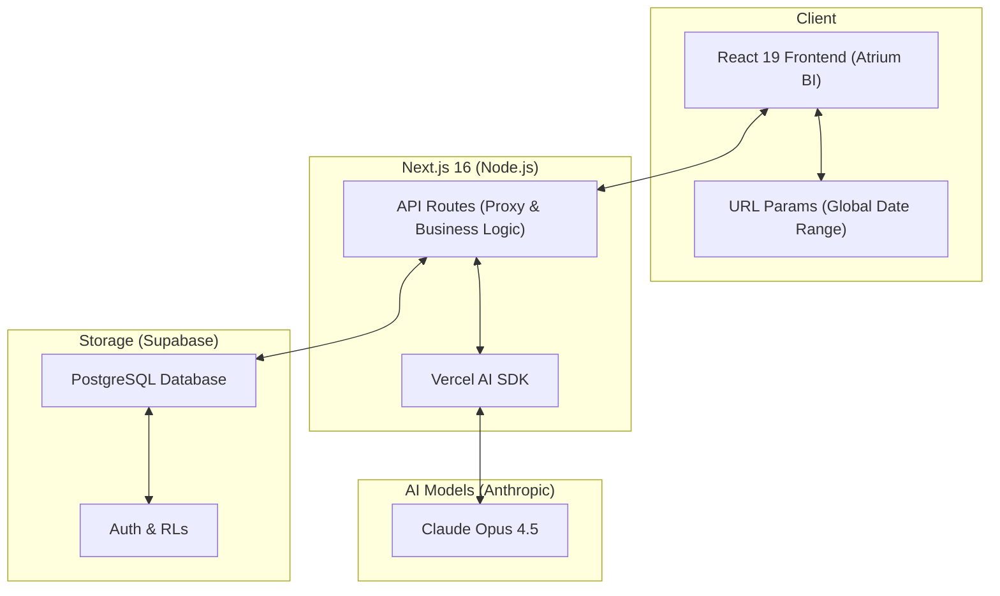

# Atrium BI 📊

**Atrium BI** is an AI-powered business intelligence platform designed for modern commerce and service-oriented businesses. This platform transforms raw transactional data into actionable insights using advanced LLMs and data-driven predictive modeling.

---

## 🚀 Overview

Atrium BI serves as the central nervous system for business operations, featuring two deeply integrated intelligence layers:

1.  **Direct Dashboard**: A conversational AI interface for rapid querying and "vibe checks" of business health.
2.  **Atrium Analytics**: A comprehensive hub for predictive modeling, inventory optimization, and customer segmentation.

---

## 🏗️ System Architecture



---

## 🧠 AI Model Specifications

The Atrium BI platform leverages state-of-the-art Large Language Models to deliver precise business intelligence:

| Component | Model | Role |
| :-- | :-- | :-- |
| **Direct Chat** | `anthropic/claude-opus-4.5` | Handles complex natural language reasoning and provides live context-aware insights. |
| **Morning Briefing** | `anthropic/claude-opus-4.5` | Synthesizes ledger deltas into narrative business summaries. |
| **Scenario Simulator** | Custom Logic + LLM | Combines historical revenue data with LLM-guided elasticity heuristics. |
| **Opportunity Detection** | Semantic Analysis | Identifies cross-sell and retention patterns from customer segments. |

---

## 🛠️ Key Components & AI Features

### 1. Conversational Intelligence (`ChatInterface`)
*   **Engine**: Claude-powered business assistant.
    *   **Context Aware**: Injects real-time revenue, AOV, and transaction volume into every session.
    *   **Smart Linking**: Automatically detects business-critical keywords (e.g., "Monday", "Revenue", "Customers") for instant deep-dives.

### 2. Scenario Simulator (`ScenarioSimulator`)
*   **What-If Modeling**: Predict the delta in weekly revenue and customer retention based on pricing strategy fluctuations.
*   **Data-Grounded**: Uses historical AOV and transaction volume from Supabase to calculate realistic outcomes using dynamic elasticity models.

### 3. Predictive Revenue Forecast (`PredictiveRevenueForecast`)
*   **Time-Series Analysis**: 7-day revenue projections with upper and lower confidence intervals.
*   **Trend Detection**: Identifies peak activity windows and cyclical growth patterns.

### 4. Inventory Optimization (`InventoryOptimization`)
*   **Stock Health**: Real-time monitoring of core inventory items and high-demand supplies.
*   **Predictive Reordering**: AI-calculated "Days of Supply" and status alerts (Critical/Low/Good).

### 5. Customer Segmentation & Churn (`CustomerSegmentation`)
*   **Segment Mapping**: Automatically clusters patrons into groups like *High-Value Retainers*, *Growing Mid-Market*, and *Occasional Buyers*.
*   **Churn Identification**: Risk-scoring for customers failing to maintain regular purchase cycles.

### 6. Vibe Check & Morning Briefing
*   **Vibe Check**: Real-time sentiment analysis of customer feedback and service atmosphere.
*   **Morning Briefing**: A narrative-driven comparison of today's performance vs. previous periods, delivered at the start of the business day.

---

## 🏗️ Technical Architecture

*   **Framework**: Next.js 16 (App Router)
*   **UI/Design**: React 19 + Tailwind CSS + Radix UI
*   **Database**: Supabase (PostgreSQL)
*   **AI SDK**: Vercel AI SDK
*   **Visualization**: Recharts 2.15

---

## ⚙️ Setup & Configuration

### Environment Variables
Create a `.env.local` file with your credentials:
```env
NEXT_PUBLIC_SUPABASE_URL=your-project-url
NEXT_PUBLIC_SUPABASE_ANON_KEY=your-anon-key
```

### Database Seeding
To populate the platform with sample business data, run the setup script:
```bash
node scripts/reseed-kaapi-data.js
```
*Note: This script currently seeds with specialized retail data. For general use cases, update the script to reflect your specific industry datasets.*

---

## 🔗 Global State & Navigation
The platform implements **Cross-Dashboard Date Persistence**. Use the `DashboardToggle` to switch between views; your selected date range (`from`/`to` parameters) will persist across every page, ensuring consistent analytical context.

---

## 🎨 Design Philosophy
Atrium BI uses a **Rich Aesthetic System**:
*   **Palette**: Harmonious color tokens, vibrant accents, and clean typography (Inter/Serif mix).
*   **Interactive Layers**: Glassmorphism, subtle micro-animations, and responsive layouts designed for high-efficiency business operations.

Built with ❤️ for Business Intelligence.
